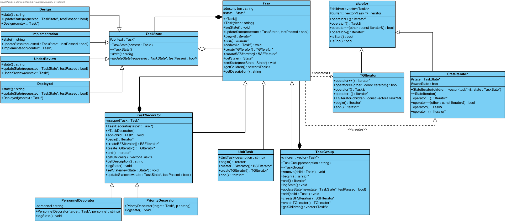

---
geometry:
  - top=1in
  - bottom=1in
  - left=1in
  - right=1in
header-includes:
  - \usepackage{float}
  - \makeatletter\def\fps@figure{H}\makeatletter
---

# COS214 Practical 4

__Courtesy of__

- Patrick Simuyemba : `u25632354`
- N'des Junior Lungwangu : `u25069366`
- member3 : ``

__Task 1: Design the System__

_Domain:_ __`Software delivery workflow`__

_Problem_

- A software-delivery workflow is not a flat list of jobs. Work is nested (epics, stories, and unit tasks), each item moves through a lifecycle, the same tree must be walkable in more than one order, and extra concerns such as priority or and extra personnel must be stacked onto a task without rewriting the task types.

_Complete UML diagram_

_GoF Participants in [Iterator, Composite, decorator, State]_

_Iterator_

- Iterator: `Iterator`
- ConcreteIterator: `TGIterator`
- Aggregate: `Task`
- ConcreteAggregate: `TaskDecorator, UnitTask, TaskGroup`

_Composite_

- Component: `Task`
- Leaf: `UnitTask`
- Composite: `TaskGroup`

_Decorator_

- Component: `Task`
- ConcreteComponent: `UnitTask`
- Decorator: `TaskDecorator`
- ConcreteDecorator: `PersonnelDecorator, PriorityDecorator`

_State_

- State: `TaskState`
- context: `Task`
- ConcreteState: `Implementation, UnderReview,Deployed`

---

 _Rationale for important design and ownership decisions_

- Over it's lifetime, a `Task` will evolve through different stages: `Implementation, UnderReview` and `Deployed`. These state emulate the stages which software has to pass through before being commercially licensed. A task object will keep track of it's state in the workflow hence it will appropriately handle dynamical memory by delete it's state when it goes out scope.

- A `TaskGroup` contains sub tasks and naturally owns these sub tasks. When the TaskGroup goes out of scope, it must delete it's sub tasks appropriately

- Features can be added to a task dynamically. For example, you can raise the priority of a task throught the `PriorityDecorator` and add personnel to work on a task through the `PeronnelDecorator`. The decorator owns the Task which it is decorating and must delete it when it goes out of scope.

__Task 2: Implement the core model__

__Task 3: Dynamic Behaviour and Design Decisions__

__Task 4: UML Diagram Portfolio__

__Task 5: Debugging and Memory Investigation__

__Task 6: Docker and GitHub Workflow__

__Task 7: Integration and Demonstration__

