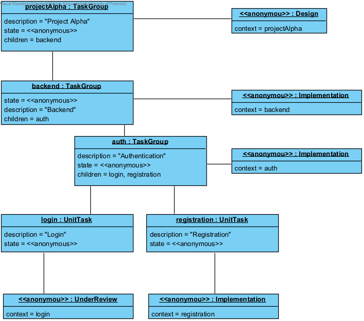
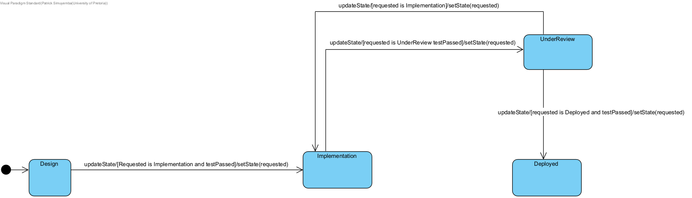
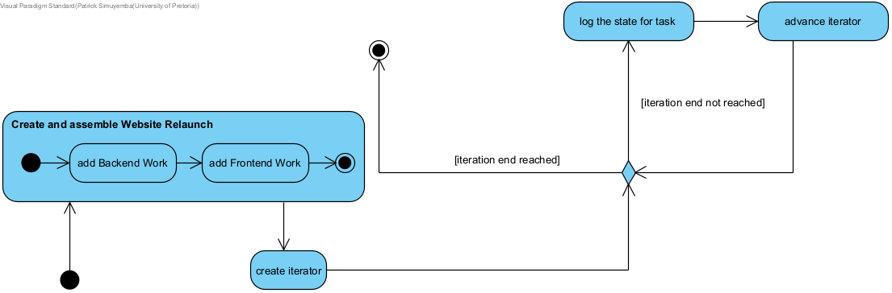
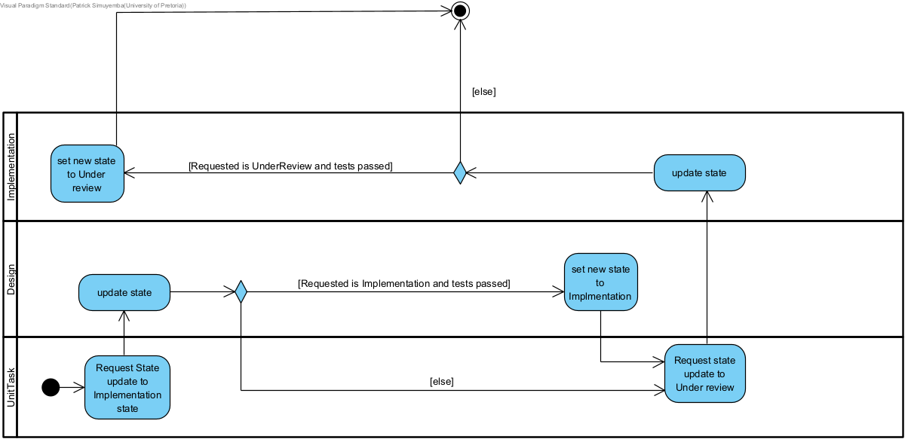
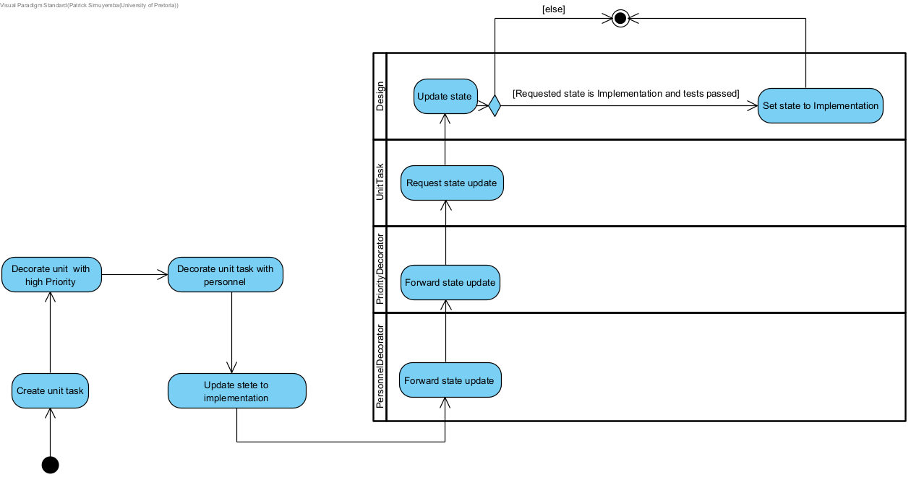

---
geometry:
  - top=1in
  - bottom=1in
  - left=1in
  - right=1in
header-includes:
  - \usepackage{float}
  - \makeatletter\def\fps@figure{H}\makeatletter
---


# COS214 Practical 4

__Courtesy of__

- Patrick Simuyemba : `u25632354`
- N'des Junior Lungwangu : `u25069366`
- member3 : `never showed up`

__Task 1: Design the System__

_Domain:_ __`Software delivery workflow`__

_Problem_

- A software-delivery workflow is not a flat list of jobs. Work is nested (epics, stories, and unit tasks), each item moves through a lifecycle, the same tree must be walkable in more than one order, and extra concerns such as priority or extra personnel must be stacked onto a task without rewriting the task types. The demo tree we actually built is `Website Relaunch` with `Backend Work` / `Frontend Work` and the unit tasks under them.

_Complete UML diagram_


_GoF Participants in [Iterator, Composite, decorator, State]_

_Iterator_

- Iterator: `Iterator`
- ConcreteIterator: `TGIterator, StateIterator`
- Aggregate: `Task`
- ConcreteAggregate: `TaskDecorator, UnitTask, TaskGroup`

_Composite_

- Component: `Task`
- Leaf: `UnitTask`
- Composite: `TaskGroup`

_Decorator_

- Component: `Task`
- ConcreteComponent: `UnitTask`
- Decorator: `TaskDecorator`
- ConcreteDecorator: `PersonnelDecorator, PriorityDecorator`

_State_

- State: `TaskState`
- context: `Task`
- ConcreteState: `Design, Implementation, UnderReview, Deployed`


 _Rationale for important design and ownership decisions_

- A `Task` starts in `Design` (the constructor does `state = new Design(this)`). Over it's lifetime it can move `Design -> Implementation -> Under Review -> Deployed`. `UnderReview` can send work back to `Implementation` (reject). `Deployed` is absorbing, it just says the task is already deployed. `updateState(requested, testPassed)` is the event. The current concrete state decides if the request is legal. Illegal requests print `Invalid Request` and `delete requested` so we dont leak the object that nobody adopted. A task owns it's `TaskState` and deletes it in the destructor / `setState`.

- A `TaskGroup` contains sub tasks and naturally owns these sub tasks. When the TaskGroup goes out of scope, it must delete it's sub tasks appropriately. `add` ignores null and duplicates. `remove` takes a child out of the vector but does not delete it (so we can wrap it and add it back, like in the sprint fast-track scenario).

- Features can be added to a task dynamically. For example, you can raise the priority of a task throught the `PriorityDecorator` and add personnel to work on a task through the `PersonnelDecorator`. The decorator owns the Task which it is decorating and must delete it when it goes out of scope. `updateState` and `logState` just forward into `wrappedTask`.

- Two iterators: `TGIterator` walks the children vector of a group (order as stored). `StateIterator` is meant to pick children matching a lifecycle. `begin()` / `end()` return fresh `Iterator*` each time so two clients can walk the same group independently. Client has to `delete` those pointers.


__Task 2: Implement the core model__


__Task 3: Dynamic Behaviour and Design Decisions__


### Scenario 1: Fast-tracking a feature mid-sprint

A `TaskGroup` representing "Sprint 12" contains two `UnitTask`s: "Fix login bug" and "Update changelog," both starting in the `Design` state. The sprint is first traversed using a `TGIterator`, visiting every task in the group without exposing the group's internal `std::vector<Task*>` to the caller, satisfying the requirement that traversal not bypass the Iterator abstraction.

Partway through the sprint, "Fix login bug" is flagged as urgent. Rather than modifying the `UnitTask` class itself or subclassing a "high priority task" type, the task is wrapped in a `PriorityDecorator` with level "Critical." This is the scenario's runtime structural change: the plain task is explicitly removed from the group via the newly added `TaskGroup::remove()` method, and the decorated version is added back in its place. Ownership transfers cleanly: the decorator now owns the underlying `UnitTask`, and the group owns the decorator.

The decorated task then progresses through its lifecycle while sitting inside the group: `updateState()` is called on it with `Implementation` as the target and a boolean from `runTests()` gating the transition. Because `TaskDecorator::updateState()` forwards to whatever it wraps, the underlying `UnitTask`'s real state changes even though the call was made on the decorator. Re-traversing the group afterward shows both the decoration ("Priority Critical") and the updated lifecycle state (`Implementation`) together, demonstrating that the decorated object participates in the system exactly like an undecorated one would.

This single scenario demonstrates traversal, a decorated object in active use, state-dependent behaviour, and a genuine structural change (removal followed by replacement) all interacting in one sequence.

### Scenario 2: A task fails review and gets kicked back

A second sprint, "Sprint 13," contains a task, "Deploy to production," which is advanced through `Design → Implementation → Under Review` before the scenario begins. Rather than reusing `TGIterator`, this scenario traverses the group with a `StateIterator`, filtering specifically for tasks currently in the `Under Review` state. This satisfies the requirement for a second traversal that differs meaningfully in purpose from the first: `TGIterator` visits everything unconditionally, while `StateIterator` selects only tasks matching a given lifecycle state.

The reviewer then rejects the task. `UnderReview::updateState()` has a distinct reject branch that transitions the task back to `Implementation` without requiring `runTests()` to have passed, since sending work backward for rework is not a "successful" transition in the same sense as approval. This is the scenario's runtime change: rather than a task moving forward through its lifecycle, it regresses. Re-running the `StateIterator` filter afterward, this time searching for `Implementation`, confirms the same task now appears under its new state.

### Traversal-invalidation policy

The current implementation does not enforce a runtime invalidation policy: if a `TaskGroup`'s children are modified while a `TGIterator` or `StateIterator` is actively traversing it, the iterator's internal `current` position (a `std::vector<Task*>::iterator`) is not protected from becoming invalid, since `std::vector::erase()` can invalidate iterators pointing at or after the erased element.

The team's intended policy is a **snapshot** approach: an iterator should capture the group's children at the moment of creation and remain valid for the duration of that traversal, unaffected by subsequent structural changes to the group. This is appropriate for the domain, since inspecting or reporting on a sprint's contents (for example, generating a status view) should not be disrupted by a task being reassigned or decorated mid-report, and a snapshot avoids the far riskier alternative of a live-updating iterator silently skipping or duplicating items as the underlying vector shifts.

Note that this is currently the intended design decision rather than an enforced guarantee: neither `TGIterator` nor `StateIterator` presently copies the children vector independently of the group's own storage, so this remains an identified gap rather than a completed safeguard. Neither of the two demonstration scenarios above requires this safeguard to run correctly, since neither one mutates a group while an iterator over it is still live.


__Task 4: UML Diagram Portfolio__

_Object diagram_



_State diagram_

- Snapshot of `Task` lifecycle through Design and Implementation (This idea applies to other states)



_Activity diagram 1 - status walk of Website Relaunch_

- Assemble the epic then walk it with `TGIterator`



_Activity diagram 2 - lifecycle requests_

- `updateState` through `UnitTask` / `Design` / `Implementation` swimlanes.



_Activity diagram 3 - decorator stack then update_

- Personnel and Priority forward `updateState` into `UnitTask` / `Design`.



__Task 5: Debugging and Memory Investigation__

_GDB: traversal_

```
gdb ./taskforge
(gdb) break TGIterator::operator++
(gdb) run
(gdb) print (*current)->getDescription()
(gdb) continue
```

First hit after `project->begin()` is `Backend Work`, next is `Frontend Work`. That is what I expected: `TGIterator` only walks the top-level children vector of `Website Relaunch`, it does not by itself walk into `Design DB schema`. `logState` on a group still dumps the nested leaves because `TaskGroup::logState` recurses.

_GDB: decorator / state_

```
(gdb) break TaskDecorator::updateState
(gdb) break Design::updateState
(gdb) run
(gdb) backtrace
```

On the stacked task (`PersonnelDecorator` wrapping `PriorityDecorator` wrapping the unit task) the stack is `main` -> decorator `updateState` -> `Task::updateState` -> `Design::updateState`. `print testPassed` and `print requested->state()`.

_Valgrind_

```
make mem
```

_Bug_

Symptom: Design -> Implementation prints the new status, but Valgrind still complains about the state object.

Cause: `Design::updateState` calls `context->setState(requested)`. `Task::setState` does `delete this->state`, and that pointer is the same `Design` whose `updateState` has not hit `}` yet. `setState` does not call `updateState`; `updateState` called `setState`, then C++ returns into a destroyed object. Decorator `updateState` only forwards, so the delete still happens on the inner `UnitTask`'s `Design`.


__Task 6: Docker and GitHub Workflow__

- `github: ` https://github.com/patrickkaleo/COS214_P4

Dockerfile is Ubuntu 22.04 with `g++`, `make`, `gdb`, `valgrind`. It copies `makefile`, `include/`, `src/` and `make`s `taskforge`. Default cmd is `./taskforge`.

```
docker build -t taskforge .
docker run --rm taskforge
docker run --rm --entrypoint make taskforge mem
```

GDB inside docker needs ptrace:

```
docker run --rm -it --cap-add=SYS_PTRACE --security-opt seccomp=unconfined --entrypoint gdb taskforge ./taskforge
```

_Reflection_

- Work was split along the four patterns and kept on two branches, `dev` and `ndes`. We integrated by merge and pull rather than a single end-of-week dump. There are no GitHub pull requests; collaboration shows up in those branches and in merge commit `4f84853`.

- Patrick Simuyemba (`u25632354`) owned the repo setup, Task 1 design, most of the Composite and Iterator core (Task 2), the UML activity and object diagrams (Task 4), and Tasks 5-6 (GDB/Valgrind, Dockerfile, `taskforge` Makefile, README). N'des Junior Lungwangu (`u25069366`) owned State and Decorator and the demo `main`.

- Patrick's line starts at `ed53f64` and `f638ecc` (1 Sep): initial repo, `submission.md`, and the PDF/zip scripts. `329dd78` (2 Sep) is Task 1 - domain, class diagram, and GoF mapping. `77bd118`, `7bbe88a`, and `eeaff87` (3-5 Sep) are the Task 2 iterator slice: `begin()`/`end()`, iterator interfaces, and `TGIterator`. `dee0338` (5 Sep) is the overlapping Decorator and Iterator work. `cea6a01` (6 Sep) updates the Task 4 figures.

- N'des appears on `dev` from `d45ebe6` (3 Sep, names and delegation). `b13f6c6` (4 Sep) adds constructors and `setState`. `4f84853` (6 Sep, *Decorator fixes*) is a merge with two parents: N'des's decorator branch and Patrick's iterator line. That is the integration point. `a58bb04` (6 Sep, on `ndes`) is the Task 2 demo, brought onto `dev` with `git pull origin ndes`.

- `dev` was the integration branch; `ndes` was N'des's feature line. The two histories met in `4f84853` and in the later fast-forward of `ndes` onto `dev`.


__Task 7: Integration and Demonstration__
# TaskForge Demo Script

## Opening

TaskForge manages a software delivery workflow. Work is organized into sprints, which can contain both individual tasks and nested sub-groups. Individual tasks move through a lifecycle, from Design through to Deployed, and can pick up extra responsibilities at runtime, like being flagged urgent, without needing a new subclass for every combination.

## Scenario 1: Fast-tracking a feature

Run it live, narrate as it prints:

Here's Sprint 12, with two tasks. First I traverse it with a TGIterator, which visits every task without me ever touching the group's internal vector directly, that's the Iterator pattern keeping traversal separate from the group's actual storage.

Now Fix login bug gets flagged urgent. I don't subclass UnitTask, I wrap it in a PriorityDecorator. That's a structural change at runtime, I remove the plain task from the group and add back the decorated version, ownership transfers cleanly: the decorator now owns the task, the group owns the decorator.

Then I advance its state while it's still sitting inside the group. Because the decorator forwards updateState() to whatever it wraps, the real underlying task's lifecycle actually changes. Re-traversing the group shows both the priority label and the new state together.

## Scenario 2: A rejected review

Sprint 13 has a task already sitting in Under Review. Here I use a different iterator, StateIterator, which filters by lifecycle state instead of visiting everything. That's the second, meaningfully different traversal the spec requires.

The reviewer rejects it. UnderReview has a specific reject path that sends the task back to Implementation, notice this doesn't require the same test-passed condition as approving forward, since sending something back for rework isn't the same kind of transition as approving it.

Filtering again with StateIterator, now for Implementation, finds the same task under its new state, that's a runtime change, but a regression, not just forward progress.

## Traversal-invalidation policy

We settled on a snapshot policy, an iterator should be unaffected by structural changes made after it's created. Right now that's the intended design, not yet fully enforced, since neither iterator independently copies the children vector, that's a known gap we're flagging rather than hiding.

## Ownership and destruction

TaskGroup owns and deletes its children in its destructor. TaskDecorator owns and deletes whatever it wraps. TaskGroup::remove(), which we added specifically to support Scenario 1, deliberately does not delete, ownership transfers to the caller instead, that's what lets a plain task survive being pulled out and re-wrapped.

## GDB / Valgrind

We hit a real double-delete bug during development, calling delete this inside a state's updateState() after setState() had already deleted the same object. AddressSanitizer caught it as a heap-use-after-free. Final build runs clean under Valgrind, no leaks.

## Closing

That's the four patterns working together as one system, not four separate demos, plus a documented, if not fully enforced, policy for what happens when the structure changes underneath a live traversal.


